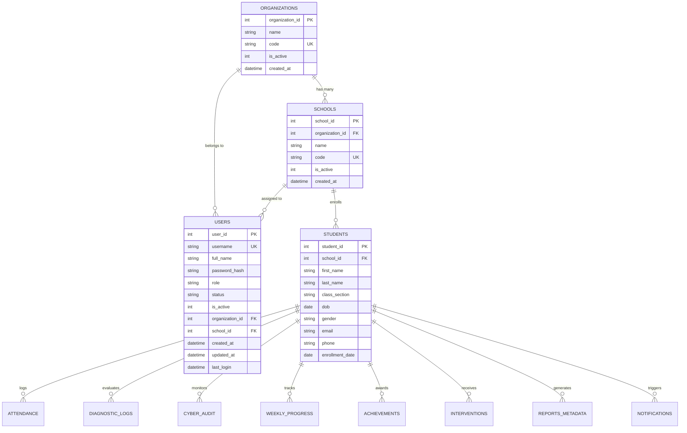

# PMLA-SCWE Version 2.0 — Architecture Specification
## Multi-School Tenancy & Role-Based Authorization Foundation (Phase 1)

---

## 1. Executive Overview & Tenancy Model

PMLA-SCWE Version 2.0 transitions the platform from a single-school database architecture into a **hierarchical multi-school multi-tenant platform**. 

The fundamental structural hierarchy is:

```
                    ORGANIZATIONS (Root Tenant Boundary)
                               │
                               │ 1 : N
                               ▼
                        SCHOOLS (Operational Tenant Unit)
                               │
          ┌────────────────────┼────────────────────┐
          │                    │                    │
          ▼                    ▼                    ▼
        USERS               STUDENTS         Future Classes
          │                    │
          ├── user_id          ├── student_id
          ├── username         ├── school_id
          ├── password_hash    ├── first_name, last_name
          ├── role             ├── class_section
          ├── is_active        │
          ├── organization_id  ├── Attendance (via student_id)
          └── school_id        ├── Diagnostic_Logs (via student_id)
                               ├── Cyber_Audit (via student_id)
                               ├── Weekly_Progress (via student_id)
                               ├── Achievements (via student_id)
                               ├── Interventions (via student_id)
                               └── Reports_Metadata (via student_id)
```

### Key Architectural Tenet: Safe Boundary Scoping
Rather than blindly duplicating `school_id` into every leaf table, Phase 1 establishes direct tenant association on the two root entities:
1. **`Students`**: Directly scoped via `school_id`. All child records (`Attendance`, `Diagnostic_Logs`, `Cyber_Audit`, `Weekly_Progress`, `Achievements`, `Interventions`, `Reports_Metadata`) reference `student_id`, inheriting tenant scoping cleanly without redundant denormalization.
2. **`Users`**: Associated with `organization_id` and `school_id` for authorization scoping.

---

## 2. Entity Relational Schema (Phase 1)



---

## 3. Role-Based Access Control (RBAC) & Permission Matrix

| Capability / Action | Admin | Teacher | Viewer |
| :--- | :---: | :---: | :---: |
| **Manage Users** (`create_user`, `update_user`, `delete_user`) | **Allowed** | Denied | Denied |
| **Manage Organizations & Schools** | **Allowed** | Denied | Denied |
| **Student Profiles CRUD** (`add_student`, `update_student`, `delete_student`) | **Allowed** | **Allowed** | Denied (Read-Only) |
| **Record Daily & Bulk Attendance** | **Allowed** | **Allowed** | Denied (Read-Only) |
| **Create & Manage Teacher Interventions** | **Allowed** | **Allowed** | Denied (Read-Only) |
| **View Analytics & Dashboards** | **Allowed** | **Allowed** | **Allowed** |
| **Generate Vector PDF Reports** | **Allowed** | **Allowed** | **Allowed** |
| **Run Diagnostic & Risk Engines** | **Allowed** | **Allowed** | **Allowed** |

### Phase 1 Tenant Boundary Rules
1. **Admin**: Authorized for school-wide access within their assigned organization and school scope.
2. **Teacher**: Strictly school-scoped access. Cannot query or modify records belonging to other schools.
3. **Viewer**: Strictly school-scoped read-only access.
4. **Inactive Users (`is_active = 0`)**: Immediate revocation of all system access across desktop and web interfaces.

---

## 4. `AuthenticatedUser` Context Lifecycle

### Server-Side Identity Verification
To prevent privilege escalation from client-side cookies or forged session payloads:
1. Web layer stores only authenticated user ID (`session["user_id"] = user_id`).
2. Every request derives the authoritative user context via `authorization_service.get_authenticated_user_context(user_id)`.
3. The database is queried for `is_active`, `role`, `organization_id`, and `school_id`. If deactivated in the DB, access is rejected immediately without session token reuse.

```
       Client Request
             │
             ▼
     Session / Controller Context (user_id)
             │
             ▼
     authorization_service.get_authenticated_user_context(user_id)
             │
             ├── Query DB: Users WHERE user_id = ?
             ├── Validate: is_active == 1
             ├── Resolve: role, organization_id, school_id
             │
             ▼
     AuthenticatedUser Context Object
             │
             ├── RBAC Check (e.g., can_manage_users, can_modify_students)
             └── Tenant Scope Check (e.g., has_school_access)
```

---

## 5. Backward Compatibility & Migration Guarantees

1. **Idempotent Default Tenants**: Provision of `PMLA-SCWE Default Organization` (`DEFAULT_ORG`) and `Default School` (`DEFAULT_SCHOOL`) ensures that existing single-school data is wrapped in a valid tenant boundary.
2. **Dual Status Support**: Existing `status` ('Active' / 'Inactive') and modern `is_active` (1 / 0) remain synchronized.
3. **Multi-Engine Support**: Full compatibility maintained for SQLite fallback mode and MySQL enterprise production deployments.
4. **Versioned Tracking**: `Schema_Migrations` table tracks applied migrations preventing redundant execution.
