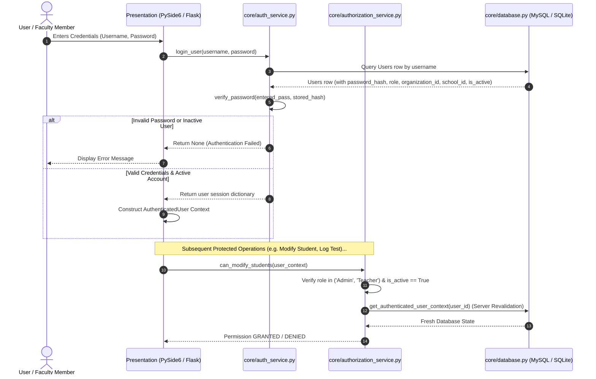
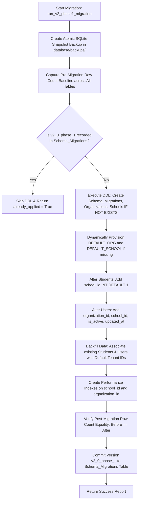

# PMLA-SCWE: Current System Architecture Specifications
## Version 2.0 (Phase 1 Checkpoint) Architectural Blueprint

---

## 1. High-Level Service-Oriented Architecture (SOA)

PMLA-SCWE employs a **Shared-Core Service-Oriented Architecture (SOA)** where presentation frontends are strictly decoupled from business logic and analytical algorithms:

```mermaid
flowchart TD
    subgraph Presentation_Layer [Presentation Frontends]
        DESK["PySide6 Desktop Client (Qt 6)"]
        WEB["Flask Web Console (Jinja2)"]
    end

    subgraph Security_Layer [Authentication & Authorization]
        AUTH["auth_service.py (PBKDF2 Hashing)"]
        RBAC["authorization_service.py (AuthenticatedUser Context)"]
        USER["user_service.py (Tenant Accounts)"]
    end

    subgraph Shared_Core_Services [Shared Core Services (core/)]
        P360["student_profile_service.py (Student 360° SSoT)"]
        RISK["risk_engine.py (0-100 Risk Engine)"]
        EXP["explainability.py (Evidence Factors)"]
        ANLY["analytics.py (OLS Linear Regression & LHS)"]
        CMD["command_center_service.py (Executive KPIs)"]
        NOTIF["notification_service.py (Smart Deduplication)"]
        IVS["intervention_service.py (Baseline Snapshots)"]
        IVA["intervention_analytics.py (Deltas & Scoring)"]
        REP["report_service.py (ReportLab Vector PDF & CSV)"]
        AI["ai_assistant.py (Gemini / OpenAI / Offline Engine)"]
        TEN["tenant_service.py (Organizations & Schools)"]
        MIG["migration_service.py (Schema Migrations Engine)"]
        BAK["backup_service.py (SQLite Snapshots & Dumps)"]
    end

    subgraph Data_Routing_Layer [Database Abstraction Layer (core/database.py)]
        ROUTER{"Connection Router & Active Backend Detector"}
        MYSQL[("MySQL 8.0+ Primary (Port 3306)")]
        SQLITE[("SQLite3 Fallback (pmla_scwe_fallback.db)")]
    end

    DESK --> AUTH
    DESK --> RBAC
    DESK --> Shared_Core_Services

    WEB --> AUTH
    WEB --> RBAC
    WEB --> Shared_Core_Services

    Security_Layer --> ROUTER
    Shared_Core_Services --> ROUTER

    ROUTER -->|Primary Reachable| MYSQL
    ROUTER -->|MySQL Offline / Failover| SQLITE
```

---

## 2. Multi-School Tenancy Hierarchy

Version 2.0 establishes hierarchical tenant boundaries:

```text
                     ORGANIZATIONS (Root Tenant Boundary)
                               │
                               │ 1 : N
                               ▼
                        SCHOOLS (Operational Tenant Unit)
                               │
           ┌───────────────────┴───────────────────┐
           ▼                                       ▼
         USERS                                  STUDENTS
  (Faculty & Administrators)               (Enrolled Learners)
           │                                       │
           ├── user_id                             ├── student_id
           ├── username                            ├── school_id (FK)
           ├── role (Admin/Teacher/Viewer)         ├── first_name, last_name
           ├── organization_id (FK)                ├── class_section
           └── school_id (FK)                      │
                                                   ├── Attendance (via student_id)
                                                   ├── Diagnostic_Logs (via student_id)
                                                   ├── Cyber_Audit (via student_id)
                                                   ├── Weekly_Progress (via student_id)
                                                   ├── Achievements (via student_id)
                                                   └── Interventions (via student_id)
```

---

## 3. Authentication & Server-Side Revalidation Flow



---

## 4. RBAC Capability & Boundary Scoping Matrix

```text
┌──────────────────────────────┬───────────────────┬───────────────────┬───────────────────┐
│ System Capability            │ Admin Role        │ Teacher Role      │ Viewer Role       │
├──────────────────────────────┼───────────────────┼───────────────────┼───────────────────┤
│ Manage Users                 │ ALLOW             │ DENY              │ DENY              │
│ Manage Organizations/Schools │ ALLOW             │ DENY              │ DENY              │
│ School Access Scope          │ ALL Schools       │ Assigned School   │ Assigned School   │
│ Create/Edit Students         │ ALLOW             │ ALLOW             │ DENY (Read-Only)  │
│ Record Daily Attendance      │ ALLOW             │ ALLOW             │ DENY (Read-Only)  │
│ Log Diagnostic Tests         │ ALLOW             │ ALLOW             │ DENY (Read-Only)  │
│ Log Cyber-Wellness Audits    │ ALLOW             │ ALLOW             │ DENY (Read-Only)  │
│ Create/Manage Interventions  │ ALLOW             │ ALLOW             │ DENY (Read-Only)  │
│ View Analytics & Dashboards  │ ALLOW             │ ALLOW             │ ALLOW             │
│ Export PDF & CSV Reports     │ ALLOW             │ ALLOW             │ ALLOW             │
└──────────────────────────────┴───────────────────┴───────────────────┴───────────────────┘
```

---

## 5. Database Connection Routing & Abstraction Architecture

`core/database.py` handles database communication dynamically:

```text
                        get_connection()
                               │
            Is mysql-connector-python available?
                     ├── No ──► Connect to SQLite (pmla_scwe_fallback.db)
                     │
                    Yes
                     │
            Attempt connection to MySQL (Port 3306)
                     ├── Success ──► Return MySQL Connection (Primary Mode)
                     └── Failure ──► Fall back to SQLite (pmla_scwe_fallback.db)
```

- **Parameterized Queries**: All SQL execution uses parameterized placeholders (`%s` for MySQL, `?` for SQLite) via query normalization in `_normalize_query()`.
- **Foreign Key Constraints**: Foreign keys are enabled on both MySQL (`ENGINE=InnoDB`) and SQLite (`PRAGMA foreign_keys = ON`).

---

## 6. Migration Pipeline Architecture


