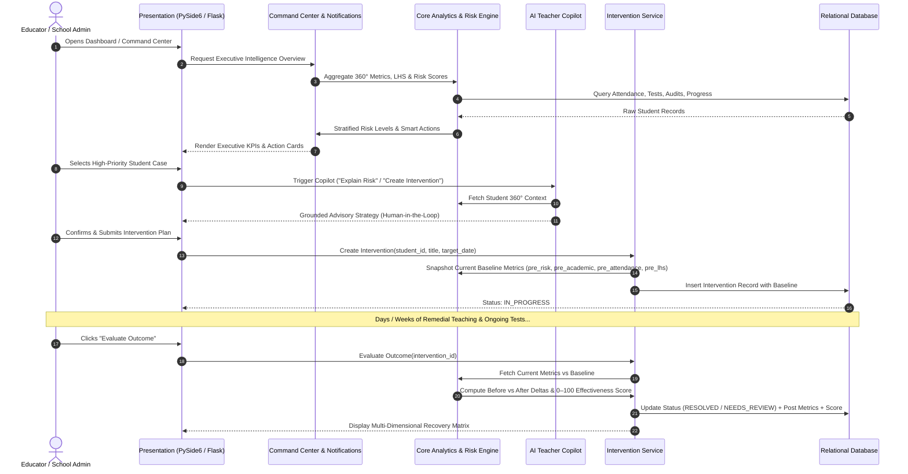
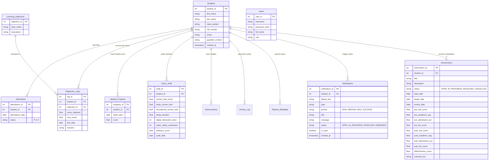

# PMLA-SCWE: System Architecture, Database Schema & ER Diagram

**Version 1.8 — Submission Edition**

> [!NOTE]
> **STATUS: HISTORICAL / ARCHIVAL DOCUMENT (v1.8 System Architecture & ERD Archive)**  
> This file is preserved for historical reference. For the active Version 2.0 multi-school multi-tenant architecture and schema specifications, see:
> - Current Architecture: [CURRENT_SYSTEM_ARCHITECTURE.md](file:///d:/PMLA-SCWE/documentation/CURRENT_SYSTEM_ARCHITECTURE.md)
> - Database Architecture: [DATABASE_ARCHITECTURE.md](file:///d:/PMLA-SCWE/documentation/DATABASE_ARCHITECTURE.md)
> - Master Documentation: [PROJECT_MASTER_DOCUMENTATION.md](file:///d:/PMLA-SCWE/documentation/PROJECT_MASTER_DOCUMENTATION.md)

---

## 1. High-Level Closed-Loop Architecture

The PMLA-SCWE platform implements a **closed-loop educational intelligence lifecycle**:

```mermaid
flowchart TD
    subgraph Data Layer
        DB[(MySQL Database / SQLite Fallback)]
        S[Students] --> DB
        ATT[Daily Attendance] --> DB
        DIAG[Diagnostic Assessments] --> DB
        WP[Weekly Progress] --> DB
        CW[Cyber Wellness Audits] --> DB
        IV[Interventions & Baselines] --> DB
        NOTIF[Smart Notifications] --> DB
    end

    subgraph Intelligence & Analytics Layer (core/)
        P360[Student 360° Profile Service]
        LHS[Learning Health Score Engine]
        RISK[Explainable Risk Engine]
        EXP[Explainability Evidence Synthesizer]
        COP[AI Teacher Copilot with Offline Engine]
        IVA[Intervention Analytics & Deltas]
        NOTS[Smart Notification Engine]
        CMD[Executive Command Center Aggregator]
        REP[Report Generation Engine]

        DB --> P360
        P360 --> LHS
        P360 --> RISK
        RISK --> EXP
        EXP --> NOTS
        P360 --> COP
        DB --> IVA
        NOTS --> CMD
        IVA --> CMD
        LHS --> CMD
        RISK --> CMD
        P360 --> REP
        IVA --> REP
    end

    subgraph Dual Presentation Layer
        GUI[PySide6 Desktop Application]
        WEB[Flask Web Console]
        
        CMD --> GUI
        CMD --> WEB
        COP --> GUI
        COP --> WEB
        REP --> GUI
        REP --> WEB
    end
```

---

## 2. Intelligence Cycle Workflow Sequence



---

## 3. Entity-Relationship (ER) Diagram



---

## 4. Key Mathematical Formulations

### 1. Learning Health Score (LHS)
Composite 0–100 index representing the holistic learning wellbeing:
$$\text{LHS} = (\text{Academic Average} \times 0.40) + (\text{Attendance Rate} \times 0.40) + (\text{Cyber-Wellness Score} \times 0.20)$$
*Dynamic Normalization: If wellness audit is pending, weights normalize to $50\% / 50\%$ across available components without false-zero penalties.*

### 2. Multi-Factor Explainable Risk Score
Transparent 0–100 risk formulation decomposing deficit contributions:
$$\text{Deficit}_{\text{Acad}} = \max(0, 100 - \text{Academic Average})$$
$$\text{Deficit}_{\text{Att}} = \max(0, 100 - \text{Attendance Rate})$$
$$\text{Deficit}_{\text{Well}} = \max(0, 100 - \text{Wellness Score})$$
$$\text{Deficit}_{\text{Slope}} = \text{Penalty derived from Simple Linear Regression slope } m$$

$$\text{Composite Risk} = \sum (\text{Deficit}_i \times w_i) \quad \text{where } \sum w_i = 1.0$$

### 3. Intervention Outcome Effectiveness Score
$$\Delta_{\text{Risk}} = \max(0, \text{Pre Risk} - \text{Post Risk})$$
$$\Delta_{\text{Acad}} = \max(0, \text{Post Acad} - \text{Pre Acad})$$
$$\Delta_{\text{Att}} = \max(0, \text{Post Att} - \text{Pre Att})$$
$$\Delta_{\text{LHS}} = \max(0, \text{Post LHS} - \text{Pre LHS})$$

$$\text{Effectiveness Score} = \min\Big(100.0, \max\big(0.0, (\Delta_{\text{Risk}}\times 0.35 + \Delta_{\text{Acad}}\times 0.30 + \Delta_{\text{Att}}\times 0.20 + \Delta_{\text{LHS}}\times 0.15)\times 2.5\big)\Big)$$
